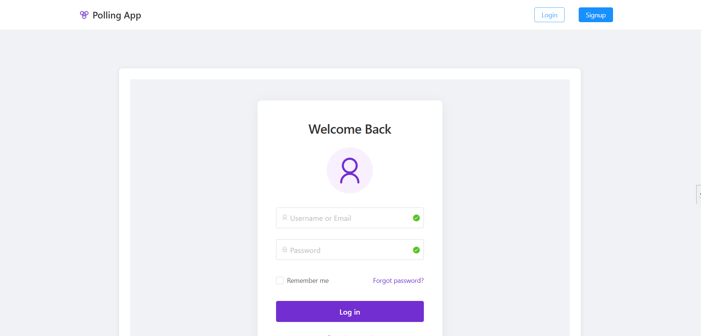
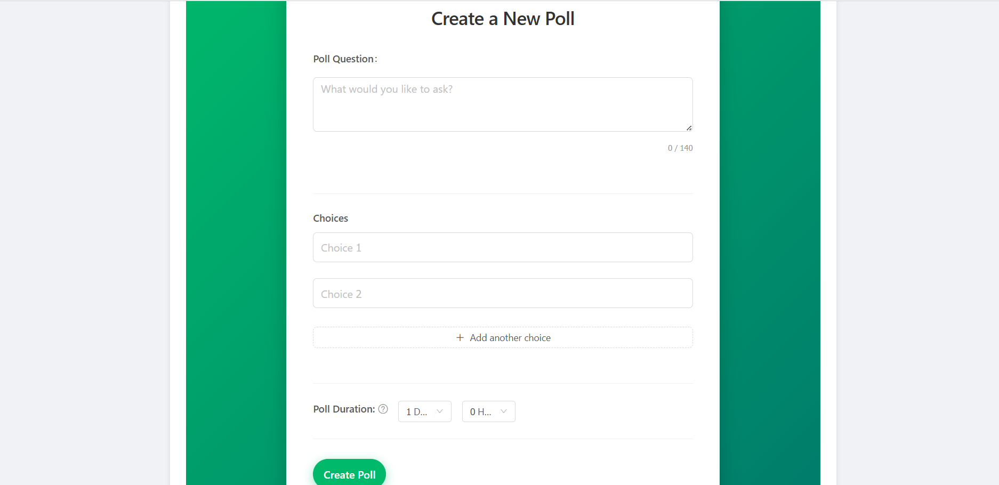
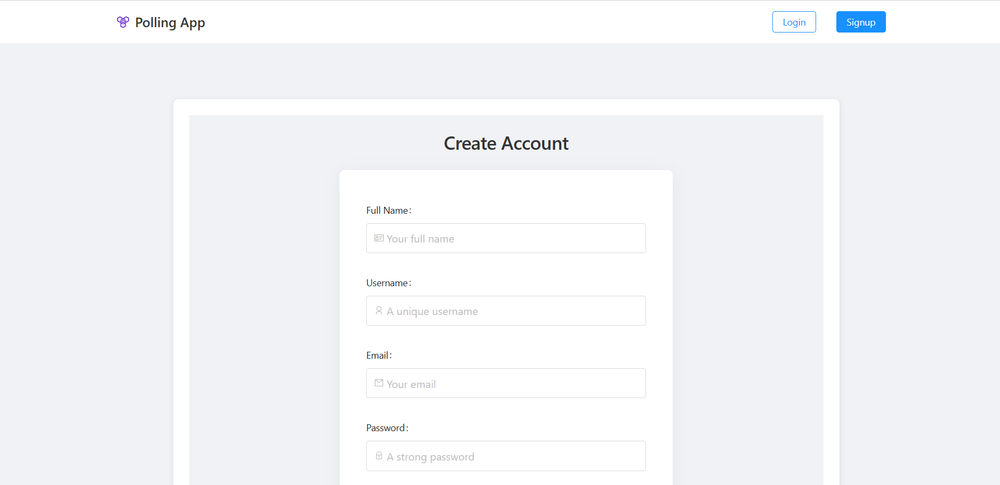
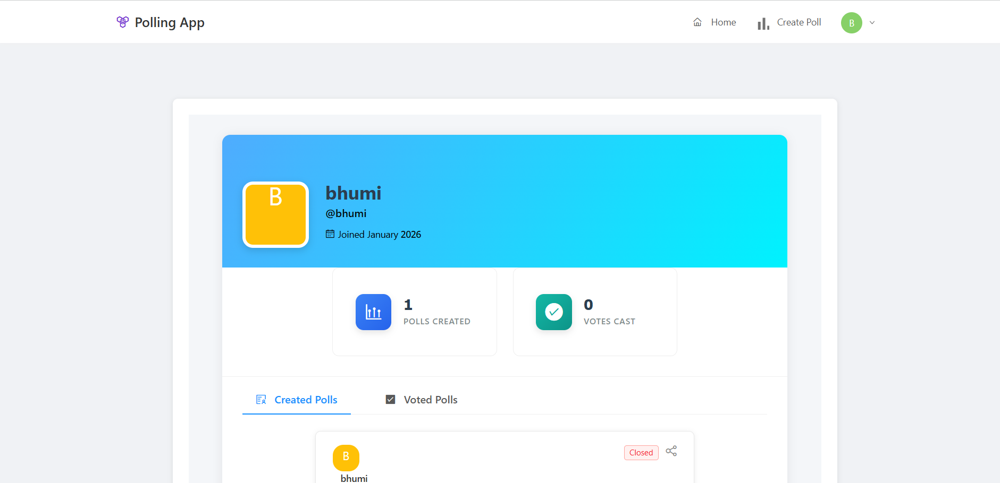

# 📊 Full-Stack Polling Application

A comprehensive, full-stack polling platform that allows users to create accounts, generate custom polls, vote in real-time, and view dynamic results. Built with **Spring Boot (Java)** for the backend and **React** for the frontend.

[](https://polling-application-3pjl.vercel.app/)
[](https://spring.io/projects/spring-boot)
[](https://reactjs.org/)
[](https://www.mysql.com/)

---

## 🚀 Live Demo

👉 **[https://polling-application-3pjl.vercel.app/](https://polling-application-3pjl.vercel.app/)**

---

## 📸 Screenshots

| **Login Dashboard** | **Create Poll** |
|:---:|:---:|
|  |  |

| **Signup / Register** | **User Profile** |
|:---:|:---:|
|  |  |

| **Main Dashboard** |
|:---:|
| .png) |

---

## ✨ Features

* **User Authentication:** Secure signup and login using JWT (JSON Web Tokens)
* **Create Polls:** Create polls with multiple options and expiration time
* **Voting System:** Real-time voting with instant result updates
* **User Profiles:** View created polls and voting history
* **Responsive UI:** Mobile-friendly design using React and Ant Design
* **RESTful API:** Clean and scalable backend API

---

## 🛠 Tech Stack

### Frontend

* React 18
* React Router
* Ant Design
* Axios

### Backend

* Spring Boot 3
* Spring Security (JWT Authentication)
* Spring Data JPA
* MySQL 8
* Maven

---

## ⚙️ Getting Started

### Prerequisites

* Node.js v18+
* Java JDK 17+
* Maven 3.8+
* MySQL 8+

---

## 📥 Installation

### 1️⃣ Clone the Repository

```bash
git clone https://github.com/your-username/polling-app.git
cd polling-app
```

---

### 2️⃣ Database Setup

Create a MySQL database:

```sql
CREATE DATABASE polls;
```

---

### 3️⃣ Backend Setup

```bash
cd polling-app-server
```

Update `src/main/resources/application.yml`:

```yaml
spring:
  datasource:
    url: jdbc:mysql://localhost:3306/polls?useSSL=false
    username: YOUR_DB_USERNAME
    password: YOUR_DB_PASSWORD
```

Build and run backend:

```bash
mvn clean install
mvn spring-boot:run
```

Backend runs on: `http://localhost:8080`

---

### 4️⃣ Frontend Setup

```bash
cd ../polling-app-client
npm install
npm start
```

Frontend runs on: `http://localhost:3000`

---

## 📂 Project Structure

```bash
.
├── polling-app-client/      # React Frontend
│   ├── public/
│   ├── src/
│   │   ├── app/             # Main App Components
│   │   ├── common/          # Reusable Components
│   │   ├── constants/       # API Constants
│   │   ├── poll/            # Poll Components
│   │   ├── user/            # User Components
│   │   └── util/            # API Utilities
│   └── ...
└── polling-app-server/      # Spring Boot Backend
    ├── src/main/java/com/example/polls/
    │   ├── config/
    │   ├── controller/
    │   ├── model/
    │   ├── payload/
    │   ├── repository/
    │   ├── security/
    │   └── service/
    └── ...
```

---

## 🐳 Docker Deployment (Optional)

Build images:

```bash
docker build -t polling-app-client ./polling-app-client
docker build -t polling-app-server ./polling-app-server
```

Run with Docker Compose:

```bash
docker-compose up -d
```

---

## 🔧 Troubleshooting

| Issue                | Solution                                                   |
| -------------------- | ---------------------------------------------------------- |
| Backend not starting | Check MySQL status & credentials, ensure port 8080 is free |
| Frontend API error   | Verify `API_BASE_URL` matches backend URL                  |
| Login/Signup issues  | Ensure roles table exists in DB                            |
| CORS errors          | Match allowed origins in backend config                    |

---

## 🤝 Contributing

1. Fork the repository
2. Create a feature branch (`git checkout -b feature/YourFeature`)
3. Commit changes (`git commit -m "Add YourFeature"`)
4. Push to branch (`git push origin feature/YourFeature`)
5. Open a Pull Request

---

## 📄 License

This project is licensed under the **MIT License**.

---

⭐ If you like this project, consider giving it a star!
